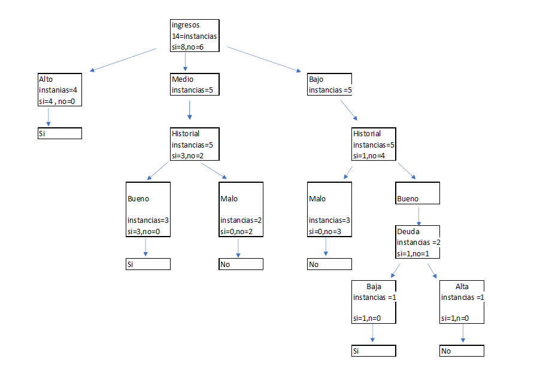
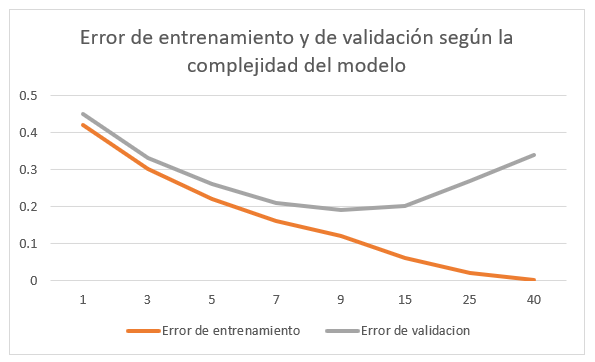
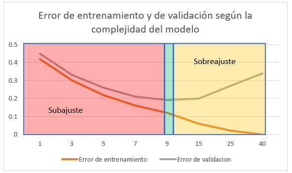

```{r setup, include=FALSE}
library(knitr)
library(kableExtra)

knitr::opts_chunk$set(
  echo      = FALSE,
  warning   = FALSE,
  message   = FALSE,
  fig.pos   = "H",
  out.width = "80%",
  fig.align = "center"
)
```

```{r portada, results='asis'}
if (knitr::is_latex_output()) {
  fecha <- paste0(
    format(Sys.Date(), '%d'), ' de ',
    c('enero','febrero','marzo','abril','mayo','junio','julio','agosto',
      'septiembre','octubre','noviembre','diciembre')[as.integer(format(Sys.Date(),'%m'))],
    ' de ', format(Sys.Date(), '%Y')
  )
  cat(
    '\\thispagestyle{empty}\n',
    '\\begin{center}\n',
    '\\vspace*{2cm}\n',
    '\\includegraphics[width=5cm]{Austral logo.png}\\\\[3em]\n',
    '{\\LARGE\\bfseries Clasificación: Árboles de Decisión, Clasificadores Basados en Reglas y Sobreajuste}\\\\[1.5em]\n',
    '{\\large Introducción a Data Mining $\\cdot$ Maestría en Explotación de Datos y Gestión del Conocimiento $\\cdot$ Universidad Austral}\\\\[1em]\n',
    paste0('{\\normalsize ', fecha, '}\n'),
    '\\end{center}\n',
    '\\newpage\n',
    sep = ''
  )
}
```

```{r word-disclaimer, results='asis'}
if (!knitr::is_latex_output()) {
  cat("> **AVISO: este archivo Word es solo un volcado de contenido.**\n>
> El documento oficial con formato completo es el **PDF**.\n>
> Tablas, estilos, encabezados y fuentes no reflejan la versión final.\n>
> Usar este archivo únicamente para copiar o revisar texto.\n\n")
}
```

<!-- PÁGINA DE INTEGRANTES -->

\newpage
\thispagestyle{empty}

\vspace*{8cm}

\begin{center}

{\LARGE \textbf{Integrantes del grupo}}

\vspace{2.5em}

{\large Ulises Catalano}

\vspace{1em}

{\large Juan Pablo Fara}

\vspace{1em}

{\large Marcos Maceo}

\vspace{1em}

{\large Andres Rodriguez}

\end{center}

\tableofcontents

# Parte A. Árboles de Decisión: Impureza e Inducción

*El Conjunto de Datos 1 registra 14 solicitudes de crédito. Cada solicitud se describe mediante tres atributos predictores (Ingreso, Historial crediticio y Deuda) y el atributo de clase Otorga, que indica si se otorgó el crédito.*

## Ejercicio 1. Medidas de impureza y selección del atributo raíz

*Con base en el Conjunto de Datos 1:*

*a) Calcule la entropía y el índice de Gini del nodo raíz, es decir, antes de realizar cualquier partición.*

Las medidas de impureza del conjunto original arrojan los siguientes resultados:

```{r tabla-impureza-raiz}
medidas <- data.frame(
  Medida = c("Entropía inicial", "Gini inicial"),
  Valor  = c("0,9852", "0,4898")
)
knitr::kable(medidas, booktabs = TRUE,
             caption = "Medidas de impureza del nodo raíz",
             linesep = "", align = c("l", "r")) |>
  kableExtra::kable_styling(latex_options = "HOLD_position", position = "center") |>
  kableExtra::column_spec(1, width = "6cm") |>
  kableExtra::column_spec(2, width = "4cm")
```

*Nota.* Elaboración propia a partir de los datos del enunciado.

*b) Para cada uno de los tres atributos candidatos (Ingreso, Historial y Deuda), calcule la entropía ponderada de los nodos hijos y la ganancia de información correspondiente.*

*c) Calcule asimismo el índice de Gini ponderado de cada atributo candidato y la reducción de la impureza de Gini que este produce.*

Para cada atributo se calculó la ganancia de información y la reducción de impureza medida mediante el índice de Gini:

```{r tabla-ganancia}
atributos <- data.frame(
  Variable                  = c("Historial", "Deuda", "Ingreso"),
  `Entropía ponderada`      = c("0,7274", "0,9740", "0,6046"),
  `Ganancia de información` = c("0,2578", "0,0113", "0,3806"),
  `Gini ponderado`          = c("0,3265", "0,4821", "0,2857"),
  `Reducción de impureza`   = c("0,1633", "0,0077", "0,2041"),
  check.names = FALSE
)
knitr::kable(atributos, booktabs = TRUE,
             caption = "Ganancia de información e índice de Gini por atributo candidato",
             linesep = "", align = c("l", "c", "c", "c", "c")) |>
  kableExtra::kable_styling(latex_options = "HOLD_position", position = "center") |>
  kableExtra::column_spec(1, width = "2.2cm") |>
  kableExtra::column_spec(2, width = "2.6cm") |>
  kableExtra::column_spec(3, width = "2.8cm") |>
  kableExtra::column_spec(4, width = "2.4cm") |>
  kableExtra::column_spec(5, width = "2.6cm")
```

*Nota.* Elaboración propia a partir de los datos del enunciado.

*d) Indique qué atributo seleccionaría como raíz del árbol según la ganancia de información. ¿Coincide la elección con la que indicaría el índice de Gini? Justifique su respuesta.*

Ambos criterios buscan seleccionar el atributo que mejor separa las clases (Sí y No). La ganancia de información maximiza la reducción de entropía, mientras que el índice de Gini maximiza la reducción de impureza. En este conjunto de datos, el atributo **Ingreso** presenta los mejores valores en ambos criterios, por lo que su selección como nodo raíz del árbol de decisión coincide entre ambos métodos.

## Ejercicio 2. Inducción del árbol de decisión completo

*A partir del atributo raíz seleccionado en el Ejercicio 1, continúe la inducción del árbol de decisión de manera recursiva, con la ganancia de información como criterio de partición, hasta que todos los nodos hoja sean puros o no queden atributos disponibles.*

*a) Dibuje el árbol de decisión resultante. En cada nodo interno indique el atributo de partición y, en cada hoja, la clase predicha junto con la cantidad de instancias que contiene.*

A continuación se presenta el árbol de decisión inducido a partir del Conjunto de Datos 1:

```{r arbol-decision, fig.cap="Árbol de decisión inducido sobre el Conjunto de Datos 1.", out.width="80%", fig.align="center"}

```

*b) Exprese el árbol en forma de pseudocódigo, mediante una estructura de reglas anidadas "si… entonces…".*

El árbol se expresa mediante la siguiente estructura de reglas anidadas:

```
SI Ingreso = "Alto" ENTONCES
    Otorga = "Sí"
SI Ingreso = "Medio" ENTONCES
    SI Historial = "Bueno" ENTONCES  Otorga = "Sí"
    SI Historial = "Malo"  ENTONCES  Otorga = "No"
SI Ingreso = "Bajo" ENTONCES
    SI Historial = "Malo"  ENTONCES  Otorga = "No"
    SI Historial = "Bueno" ENTONCES
        SI Deuda = "Baja"  ENTONCES  Otorga = "Sí"
        SI Deuda = "Alta"  ENTONCES  Otorga = "No"
```

*c) ¿Cuántos nodos hoja tiene el árbol? ¿Cuál es su error de resustitución, es decir, su error sobre el propio conjunto de entrenamiento?*

El árbol cuenta con **6 nodos hoja**. Dado que todas las hojas son puras (cada una contiene instancias de una única clase), el error de resustitución es **0**.

\newpage

## Ejercicio 3. Partición de un atributo continuo

*El Conjunto de Datos 2 contiene 10 registros caracterizados por un atributo continuo, el Ingreso imponible (expresado en miles de pesos), y por el atributo de clase Evade, que indica si el contribuyente evade impuestos.*

*a) Enumere los puntos de corte candidatos, definidos como los puntos medios de los valores consecutivos del atributo ordenados.*

Los puntos de corte candidatos se determinaron a partir del punto medio entre cada par de valores consecutivos del atributo Ingreso imponible, ordenado de forma ascendente:

```{r tabla-cortes}
cortes_a <- data.frame(
  Intervalos    = c("60 – 70","70 – 80","80 – 95","95 – 100","100 – 110",
                    "110 – 115","115 – 120","120 – 130","130 – 140"),
  `Punto medio` = c("65","75","87,5","97,5","105","112,5","117,5","125","135"),
  check.names = FALSE
)
knitr::kable(cortes_a, booktabs = TRUE,
             caption = "Puntos de corte candidatos para el atributo Ingreso imponible",
             linesep = "", align = c("l", "r")) |>
  kableExtra::kable_styling(latex_options = "HOLD_position", position = "center") |>
  kableExtra::column_spec(1, width = "5cm") |>
  kableExtra::column_spec(2, width = "4cm")
```

*Nota.* Elaboración propia a partir de los datos del enunciado.

*b) Para cada punto de corte candidato, calcule el índice de Gini ponderado de la partición binaria resultante.*

Para cada punto de corte candidato se calculó el índice de Gini de los subconjuntos generados y el índice de Gini ponderado de la partición binaria resultante:

```{r tabla-gini}
gini_t <- data.frame(
  `Punto medio`    = c("65","75","87,5","97,5","105","112,5","117,5","125","135"),
  `Sí (<=)`        = c(0,0,0,1,1,2,3,4,5),
  `No (<=)`        = c(1,2,3,3,4,4,4,4,4),
  `Gini (<=)`      = c("0","0","0","0,3750","0,3200","0,4444","0,4898","0,5000","0,4938"),
  `Sí (>)`         = c(5,5,5,4,4,3,2,1,0),
  `No (>)`         = c(4,3,2,2,1,1,1,1,1),
  `Gini (>)`       = c("0,4938","0,4688","0,4082","0,4444","0,3200","0,3750","0,4444","0,5000","0"),
  `Gini ponderado` = c("0,4444","0,3750","0,2857","0,4167","0,3200","0,4167","0,4762","0,5000","0,4444"),
  check.names = FALSE
)
knitr::kable(gini_t, booktabs = TRUE,
             caption = "Índice de Gini ponderado por punto de corte candidato",
             linesep = "", align = c("c","c","c","c","c","c","c","c")) |>
  kableExtra::kable_styling(latex_options = "HOLD_position", position = "center",
                            font_size = 10) |>
  kableExtra::column_spec(1, width = "1.5cm") |>
  kableExtra::column_spec(2, width = "1.2cm") |>
  kableExtra::column_spec(3, width = "1.2cm") |>
  kableExtra::column_spec(4, width = "1.5cm") |>
  kableExtra::column_spec(5, width = "1.2cm") |>
  kableExtra::column_spec(6, width = "1.2cm") |>
  kableExtra::column_spec(7, width = "1.5cm") |>
  kableExtra::column_spec(8, width = "1.7cm")
```

*Nota.* Elaboración propia a partir de los datos del enunciado.

*c) Indique el punto de corte óptimo y exprese la condición de prueba asociada al nodo.*

El punto de corte óptimo es **105**, ya que presenta el menor índice de Gini ponderado (0,32) entre todos los candidatos evaluados. La condición de prueba asociada al nodo es $\text{Ingreso imponible} \leq 105$. Esta condición divide el conjunto de datos en dos subconjuntos: los contribuyentes con ingreso imponible menor o igual a 105 se asignan a la rama izquierda del árbol, mientras que aquellos con ingreso superior a 105 se asignan a la rama derecha.

*d) Explique por qué los árboles de decisión solo generan fronteras de decisión paralelas a los ejes de coordenadas.*

Los árboles de decisión solo generan fronteras paralelas a los ejes porque cada nodo divide los datos con base en un único atributo a la vez. Estas particiones se realizan mediante umbrales sobre una variable, lo que produce cortes alineados con los ejes del espacio de características. Por ello, las fronteras diagonales o curvas solo pueden aproximarse mediante varias divisiones consecutivas.

\newpage

# Parte B. Evaluación de Clasificadores

## Ejercicio 4. Matriz de confusión y métricas de desempeño

*Un clasificador binario fue evaluado en un conjunto de prueba de 100 pacientes para detectar una enfermedad. Se define como clase positiva "Enfermo" y como clase negativa "Sano". El modelo produjo 35 verdaderos positivos, 15 falsos negativos, 10 falsos positivos y 40 verdaderos negativos.*

*a) Construya la matriz de confusión correspondiente, identificando claramente la clase real y la predicha.*

A continuación se muestra la matriz de confusión del clasificador, donde las filas representan la clase real y las columnas la clase predicha por el modelo:

```{r tabla-confusion}
conf <- data.frame(
  ` `                      = c("Enfermo(+)", "Sano(−)", "Total"),
  `Enfermo(+) predicho`    = c("35 (VP)", "10 (FP)", "45"),
  `Sano(−) predicho`  = c("15 (FN)", "40 (VN)", "55"),
  Total                    = c("50", "50", "100"),
  check.names = FALSE
)
knitr::kable(conf, booktabs = TRUE,
             caption = "Matriz de confusión del clasificador",
             linesep = "", align = c("l","c","c","c"),
             col.names = c("Clase real / Clase predicha",
                           "Enfermo(+) predicho",
                           "Sano(−) predicho",
                           "Total")) |>
  kableExtra::kable_styling(latex_options = "HOLD_position", position = "center") |>
  kableExtra::column_spec(1, bold = TRUE, width = "4.5cm") |>
  kableExtra::column_spec(2, width = "3.5cm") |>
  kableExtra::column_spec(3, width = "3.5cm") |>
  kableExtra::column_spec(4, width = "2cm")
```

*Nota.* Elaboración propia a partir de los datos del enunciado.

El modelo identificó correctamente a 35 pacientes enfermos (verdaderos positivos) y a 40 pacientes sanos (verdaderos negativos). Sin embargo, clasificó incorrectamente a 15 pacientes enfermos como sanos (falsos negativos) y a 10 pacientes sanos como enfermos (falsos positivos).

*b) Calcule la exactitud, la tasa de error, la precisión, la sensibilidad (recall), la especificidad y la medida F1.*

A partir de la matriz de confusión: VP = 35, VN = 40, FP = 10, FN = 15, N = 100.

**Exactitud:**
$$\text{Exactitud} = \frac{VP + VN}{N} = \frac{35 + 40}{100} = 0{,}75$$

El modelo clasifica correctamente al 75 % de los pacientes.

**Tasa de error:**
$$\text{Tasa de error} = 1 - \text{Exactitud} = 0{,}25$$

El 25 % de las clasificaciones realizadas por el modelo son incorrectas.

**Precisión:**
$$\text{Precisión} = \frac{VP}{VP + FP} = \frac{35}{45} \approx 0{,}7778$$

Cuando el modelo predice que un paciente está enfermo, acierta aproximadamente en el 78 % de los casos.

**Sensibilidad (Recall):**
$$\text{Sensibilidad} = \frac{VP}{VP + FN} = \frac{35}{50} = 0{,}70$$

El modelo detecta correctamente el 70 % de los pacientes que realmente padecen la enfermedad.

**Especificidad:**
$$\text{Especificidad} = \frac{VN}{VN + FP} = \frac{40}{50} = 0{,}80$$

El modelo clasifica correctamente como sanos al 80 % de los pacientes que realmente no tienen la enfermedad.

**Medida F1:**
$$F_1 = \frac{2 \times \text{Precisión} \times \text{Sensibilidad}}{\text{Precisión} + \text{Sensibilidad}} = \frac{2 \times 0{,}7778 \times 0{,}70}{0{,}7778 + 0{,}70} \approx 0{,}7368$$

La medida F1 combina precisión y sensibilidad en un único valor, y penaliza los casos en que una de estas métricas es alta y la otra es baja. Un valor de 73,68 % muestra un desempeño aceptable y relativamente equilibrado entre la detección de enfermos y la confiabilidad de las predicciones positivas.

*c) Calcule el estadístico kappa de Cohen e interprete su valor.*

El coeficiente Kappa de Cohen cuantifica el grado de concordancia entre dos clasificaciones, con ajuste por el efecto del azar:

$$\kappa = \frac{P_o - P_e}{1 - P_e}$$

donde $P_o$ es el acuerdo observado y $P_e$ es el acuerdo esperado por azar.

**Acuerdo observado:** $P_o = 0{,}75$

**Acuerdo esperado por azar**, a partir de las proporciones marginales:

$$P_e = \left(\frac{50}{100} \times \frac{45}{100}\right) + \left(\frac{50}{100} \times \frac{55}{100}\right) = 0{,}225 + 0{,}275 = 0{,}50$$

**Estadístico Kappa:**

$$\kappa = \frac{0{,}75 - 0{,}50}{1 - 0{,}50} = \frac{0{,}25}{0{,}50} = 0{,}50$$

Un valor de $\kappa = 0{,}50$ indica un nivel de concordancia moderado, superior al que se obtendría por simple azar, aunque todavía existe margen para mejorar la capacidad de clasificación del modelo.

*d) Suponga que un falso negativo (no detectar a un paciente efectivamente enfermo) acarrea un costo mucho mayor que un falso positivo. ¿Qué métrica priorizaría para seleccionar el modelo? Justifique.*

La métrica que debe priorizarse es la **sensibilidad** (*recall*), dado que mide la capacidad del modelo para identificar correctamente a los pacientes que realmente están enfermos. En un contexto médico, un falso negativo (no detectar a un paciente efectivamente enfermo) acarrea consecuencias clínicas graves. La sensibilidad es, por lo tanto, la métrica que mejor refleja la capacidad del modelo para reducir este tipo de error, el más crítico en este escenario.

\newpage

# Parte C. Sobreajuste

## Ejercicio 5. Diagnóstico del sobreajuste

*La Tabla 3 presenta el error de un árbol de decisión sobre el conjunto de entrenamiento y sobre un conjunto de validación independiente, en función de la complejidad del modelo, medida como el número de nodos hoja.*

*a) Represente gráficamente ambas curvas de error en función de la complejidad del modelo, en un mismo sistema de ejes.*

A continuación se representan las curvas de error de entrenamiento y de validación en función de la complejidad del modelo, medida a través del número de nodos hoja del árbol de decisión:

```{r grafico-5a, fig.cap="Curvas de error de entrenamiento y de validación según la complejidad del modelo.", out.width="80%", fig.align="center"}

```

*b) Identifique las regiones de subajuste y de sobreajuste, y señale la complejidad óptima.*

A partir de las curvas obtenidas, se observa una región de **subajuste** en los modelos de menor complejidad (entre 1 y 5 nodos hoja), donde ambos errores son relativamente altos. El **sobreajuste** comienza a evidenciarse a partir de los 15 nodos hoja, ya que el error de entrenamiento sigue disminuyendo mientras que el de validación aumenta. La **complejidad óptima** corresponde a 9 nodos hoja, dado que presenta el menor error de validación (0,19).

La siguiente figura señala las regiones de subajuste y de sobreajuste, así como el punto de complejidad óptima, correspondiente al mínimo error de validación:

```{r grafico-5b, fig.cap="Regiones de subajuste y sobreajuste y punto de complejidad óptima.", out.width="80%", fig.align="center"}

```

*c) Explique por qué el error de entrenamiento decrece de forma monótona, mientras que el error de validación describe una curva en U.*

El error de entrenamiento decrece de forma monótona porque, al aumentar la complejidad del modelo, este dispone de una mayor capacidad para ajustarse a los datos de entrenamiento. En cambio, el error de validación presenta una curva en U: inicialmente disminuye al capturar mejor los patrones de los datos, pero luego aumenta debido al sobreajuste, lo que reduce la capacidad de generalización del modelo.

*d) ¿Qué complejidad de modelo seleccionaría? Justifique su elección en términos del error de generalización.*

Se seleccionaría el modelo con **9 nodos hoja**, ya que presenta el menor error de validación (0,19). Este modelo logra el mejor equilibrio entre el ajuste a los datos de entrenamiento y el desempeño sobre datos no vistos, con lo que se maximiza la capacidad de generalización.

## Ejercicio 6. Poda mediante el error pesimista

*Considere el siguiente subárbol: un nodo interno contiene 40 instancias del conjunto de entrenamiento, de las cuales 28 pertenecen a la clase "+" y 12 a la clase "−". Dicho nodo se divide en cuatro nodos hoja, cuyas distribuciones de clase se detallan en la Tabla 4.*

*a) Calcule el error de entrenamiento del nodo antes de la división (tratándolo como hoja) y después de la división.*

Antes de la división, el nodo se clasifica según la clase mayoritaria ("+"), lo que genera 12 errores sobre 40 instancias:

$$\text{Error de entrenamiento (antes)} = \frac{12}{40} = 0{,}30$$

Después de la división, cada hoja se clasifica según su clase mayoritaria (L1, L2 y L3 predicen "+"; L4 predice "−"), con un total de 11 errores resultantes:

$$\text{Error de entrenamiento (después)} = \frac{11}{40} = 0{,}275$$

La división produce una reducción del error de entrenamiento de 0,025.

*b) Calcule el error de generalización pesimista antes y después de la división, con una penalización de 0,5 por cada nodo hoja. El error pesimista se define como (errores + k · 0,5) / N, donde k es el número de hojas y N el número de instancias.*

El error de generalización pesimista se define como $\frac{\text{errores} + k \times 0{,}5}{N}$, donde $k$ es el número de hojas y $N$ el número de instancias.

**Antes de la división** ($k = 1$):
$$\text{Error pesimista} = \frac{12 + 1 \times 0{,}5}{40} = \frac{12{,}5}{40} = 0{,}3125$$

**Después de la división** ($k = 4$):
$$\text{Error pesimista} = \frac{11 + 4 \times 0{,}5}{40} = \frac{13}{40} = 0{,}325$$

Aunque la división reduce el error de entrenamiento, el incremento en la complejidad del árbol provoca un aumento del error pesimista.

*c) A partir de la comparación de los errores pesimistas, ¿debería podarse el subárbol? Justifique su respuesta.*

Sí, el subárbol debería podarse, ya que el error pesimista aumenta de 0,3125 a 0,325 después de la división. Esto indica que la mayor complejidad del subárbol no mejora la capacidad de generalización del modelo.

*d) ¿Qué relación tiene este procedimiento con el principio de parsimonia, conocido como la navaja de Occam?*

Este procedimiento está relacionado con el **principio de parsimonia** o navaja de Occam, que establece que, entre varias soluciones con desempeño similar, debe preferirse la más simple. En el contexto de los árboles de decisión, la poda busca eliminar divisiones que aumentan la complejidad del modelo sin aportar una mejora significativa en su capacidad de generalización, en favor de árboles más simples, menos propensos al sobreajuste y más fáciles de interpretar.

## Ejercicio 7. Estrategias de control del sobreajuste

*Responda de forma fundamentada a las siguientes consignas:*

*a) Distinga la pre-poda (detención temprana) de la post-poda. Indique una ventaja y una desventaja de cada estrategia.*

La **pre-poda** consiste en detener el crecimiento del árbol antes de que se complete, mediante criterios que limitan su complejidad. Su principal ventaja es que reduce el costo computacional y evita la generación de árboles excesivamente grandes. Como desventaja, puede detener el crecimiento prematuramente y perder información relevante.

La **post-poda** consiste en generar primero el árbol completo y luego eliminar las ramas que no contribuyen significativamente a la capacidad de generalización. Su ventaja es que suele producir modelos más precisos, ya que evalúa el árbol completo antes de simplificarlo. Como desventaja, requiere un mayor costo computacional.

*b) Mencione tres criterios de pre-poda que se utilicen habitualmente en la inducción de árboles de decisión.*

Tres criterios de pre-poda de uso habitual son:

- Establecer una profundidad máxima del árbol.
- Exigir un número mínimo de instancias para dividir un nodo.
- Requerir una ganancia mínima de información (o reducción mínima de impureza) para realizar una división.

*c) Un colega afirma: "Mi árbol clasifica correctamente el 100 % de los datos de entrenamiento, por lo tanto, es un excelente modelo". Critique esta afirmación de manera rigurosa.*

La afirmación no es necesariamente correcta. Un árbol que clasifica correctamente el 100 % de los datos de entrenamiento puede haber aprendido no solo los patrones relevantes, sino también el ruido presente en dichos datos; este fenómeno se conoce como sobreajuste (*overfitting*). Un error de entrenamiento nulo no garantiza una buena capacidad de generalización: para evaluar la calidad del modelo es necesario analizar su desempeño sobre datos no utilizados durante el entrenamiento.

*d) Explique cómo la validación cruzada de k pliegues permite estimar el error de generalización y por qué resulta preferible a una única partición de retención (holdout) cuando se dispone de pocos datos.*

La validación cruzada de $k$ pliegues divide el conjunto de datos en $k$ subconjuntos. En cada iteración, uno de ellos se utiliza para validación y los restantes para entrenamiento; el proceso se repite $k$ veces y el error final corresponde al promedio de los resultados obtenidos. Este método permite obtener una estimación más robusta del error de generalización, ya que todas las observaciones participan tanto en entrenamiento como en validación. Cuando se dispone de pocos datos, resulta preferible a una única partición *holdout*, porque aprovecha mejor la información disponible y reduce la dependencia de una única división de los datos.

\newpage

# Parte D. Clasificadores Basados en Reglas

## Ejercicio 8. Derivación de reglas a partir de un árbol de decisión

*Considere el árbol de decisión obtenido en el Ejercicio 2, inducido sobre el Conjunto de Datos 1.*

*a) Derive el conjunto completo de reglas de clasificación, recorriendo cada camino desde la raíz hasta una hoja.*

*b) Para cada regla, indique su cobertura (la cantidad de instancias del Conjunto de Datos 1 que satisface su antecedente) y su exactitud sobre dichas instancias.*

*c) ¿El conjunto de reglas resultante es mutuamente excluyente y exhaustivo? Justifique su respuesta.*

*d) Clasifique los siguientes solicitantes nuevos: S1 (Ingreso = Medio, Historial = Malo, Deuda = Baja) y S2 (Ingreso = Bajo, Historial = Bueno, Deuda = Alta).*

*(Pendiente.)*

## Ejercicio 9. Conjunto ordenado de reglas frente a votación

*Un sistema antifraude clasifica las transacciones como "Fraude" o "Legítima" mediante el siguiente conjunto de reglas: R1: (Monto = Alto) Y (PaisDistinto = Sí) → Fraude; R2: (HoraInusual = Sí) → Fraude; R3: (Monto = Bajo) → Legítima; R4: (ClienteAntiguo = Sí) → Legítima; Regla por defecto → Legítima. Clasifique las tres transacciones de la Tabla 5 bajo dos esquemas: (i) un conjunto ordenado de reglas, es decir, una lista de decisión con prioridad R1 > R2 > R3 > R4; y (ii) una votación no ponderada de todas las reglas cuyo antecedente se satisface.*

*a) Indique la clase asignada a cada transacción en cada uno de los dos esquemas.*

La clasificación de cada transacción bajo los dos esquemas se presenta en la siguiente tabla:

```{r tabla-clasif-reglas}
clasif <- data.frame(
  Transacción          = c("T1", "T2", "T3"),
  `Reglas satisfechas` = c(
    "R1 → Fraude; R2 → Fraude",
    "R2 → Fraude; R3 → Legítima; R4 → Legítima",
    "Ninguna regla específica"
  ),
  `Conjunto ordenado`      = c(
    "Fraude (R1, primera coincidencia)",
    "Fraude (R2 precede a R3 y R4)",
    "Legítima (regla por defecto)"
  ),
  `Votación no ponderada`  = c(
    "Fraude (2 votos Fraude, 0 Legítima)",
    "Legítima (1 voto Fraude, 2 votos Legítima)",
    "Legítima (regla por defecto)"
  ),
  check.names = FALSE
)
knitr::kable(clasif, booktabs = TRUE,
             caption = "Clasificación de transacciones bajo esquema ordenado y votación no ponderada",
             linesep = "", align = c("c","l","l","l")) |>
  kableExtra::kable_styling(latex_options = "HOLD_position", position = "center",
                            font_size = 10) |>
  kableExtra::column_spec(1, width = "2.3cm") |>
  kableExtra::column_spec(2, width = "3.5cm") |>
  kableExtra::column_spec(3, width = "3.5cm") |>
  kableExtra::column_spec(4, width = "3.8cm")
```

*Nota.* Elaboración propia a partir de los datos del enunciado.

*b) Señale en qué transacciones difieren los resultados de ambos esquemas y explique la causa de la discrepancia.*

Los dos esquemas difieren únicamente en la transacción T2. En el conjunto ordenado, R2 (HoraInusual = Sí → Fraude) precede a R3 (Monto = Bajo → Legítima) y a R4 (ClienteAntiguo = Sí → Legítima) en el orden de prioridades; al satisfacerse el antecedente de R2, la clasificación se detiene y T2 recibe la clase Fraude sin evaluar las reglas restantes. En el esquema de votación, las tres reglas cuyo antecedente se satisface emiten su voto de forma independiente: R2 aporta un voto a Fraude, mientras que R3 y R4 aportan un voto cada una a Legítima; la clase mayoritaria (2 contra 1) determina el resultado final como Legítima.

*c) Discuta una ventaja y una desventaja de cada esquema de resolución de conflictos entre reglas.*

El esquema de **conjunto ordenado** tiene como ventaja su eficiencia: la clasificación se detiene al encontrar la primera regla cuyo antecedente se satisface, sin necesidad de evaluar el resto. Su desventaja principal es que el orden de las reglas es determinante: una regla general ubicada antes que una más específica puede anularla, aun cuando la más específica sea más precisa para ese caso particular.

El esquema de **votación no ponderada** tiene como ventaja su robustez: al considerar todas las reglas aplicables de forma simultánea, el impacto de una regla individualmente incorrecta queda atenuado por las restantes. Su desventaja es el mayor costo computacional, dado que cada transacción debe ser evaluada contra la totalidad de las reglas antes de emitir una decisión.

## Ejercicio 10. Generación directa de reglas: cobertura secuencial

*El Conjunto de Datos 3 contiene 10 puntos en un espacio bidimensional, descritos por los atributos continuos x1 y x2, y etiquetados con la clase "+" o "−".*

*a) Describa, con sus propias palabras, el algoritmo de cobertura secuencial para la generación directa de reglas.*

El algoritmo de cobertura secuencial construye un conjunto de reglas de forma iterativa. En cada iteración, se busca la regla que mejor cubra instancias de la clase objetivo sin incluir instancias de otras clases, con el objetivo de maximizar una medida de calidad, como la precisión o la estimación de Laplace. Una vez identificada la regla, las instancias cubiertas se eliminan del conjunto de entrenamiento y el proceso se repite. El ciclo continúa hasta que todas las instancias de la clase objetivo han sido cubiertas o se alcanza un criterio de detención. Al finalizar, una regla por defecto asigna la clase mayoritaria a las instancias no cubiertas por ninguna regla específica (Tan et al., 2019).

*b) Aplique el algoritmo para construir un conjunto de reglas que cubra la clase "+". Cada regla debe expresarse como una conjunción de condiciones sobre x1 y x2 y no debe cubrir ningún punto de la clase "−".*

Los puntos del Conjunto de Datos 3 se distribuyen de la siguiente manera:

- Clase "+": P1(1,1), P2(1,3), P3(2,2), P4(2,4), P5(6,1)
- Clase "−": P6(4,4), P7(5,5), P8(5,3), P9(3,5), P10(6,5)

**Iteración 1.** La condición $x_1 \leq 2$ cubre P1, P2, P3 y P4, todos de clase "+", sin incluir ningún punto de clase "−" (todos los negativos tienen $x_1 \geq 3$). Se incorpora la primera regla:

$$R1: \text{SI } x_1 \leq 2 \Rightarrow \text{clase } \text{``+"}$$

Se eliminan P1, P2, P3 y P4. Positivos restantes: {P5(6,1)}.

**Iteración 2.** La condición $x_2 \leq 1$ cubre P5(6,1) sin incluir ningún negativo (todos tienen $x_2 \geq 3$). Se incorpora la segunda regla:

$$R2: \text{SI } x_2 \leq 1 \Rightarrow \text{clase } \text{``+"}$$

No quedan positivos sin cubrir. El algoritmo concluye. El conjunto de reglas resultante es:

- $R1$: SI $x_1 \leq 2$ → clase "+"
- $R2$: SI $x_2 \leq 1$ → clase "+"
- Regla por defecto: clase "−"

*c) Indique cuántas reglas fueron necesarias y discuta qué consecuencias tendría permitir reglas con una cobertura muy baja.*

La construcción requirió **dos reglas**. Si se permitieran reglas con cobertura muy baja (por ejemplo, una sola instancia por regla), el algoritmo podría generar tantas reglas como instancias positivas existan, memorizando el conjunto de entrenamiento en lugar de capturar los patrones subyacentes. Este fenómeno se conoce como sobreajuste (*overfitting*): el clasificador resultante tendría buen desempeño sobre los datos de entrenamiento pero escasa capacidad de generalización frente a instancias nuevas. Además, un número elevado de reglas excesivamente específicas reduce la interpretabilidad del modelo y dificulta su mantenimiento.

\newpage

# Parte E. Preguntas Teóricas de Desarrollo

*Responda de forma clara, precisa y fundamentada. Se valorará el uso correcto de la terminología técnica y la articulación de los conceptos.*

**1.** *Explique la diferencia entre aprendizaje supervisado y no supervisado, y ubique la tarea de clasificación dentro de esta taxonomía.*

La diferencia fundamental entre el aprendizaje supervisado y el no supervisado radica en la disponibilidad de etiquetas de clase durante el entrenamiento. En el aprendizaje supervisado, cada instancia del conjunto de entrenamiento está asociada a una etiqueta conocida, y el modelo aprende a mapear instancias a salidas mediante la minimización de un error sobre dichos ejemplos etiquetados (Tan et al., 2019).

En el aprendizaje no supervisado no se dispone de etiquetas; el objetivo consiste en descubrir estructura latente en los datos, tal como agrupamientos naturales (*clustering*) o patrones de co-ocurrencia (reglas de asociación).

La clasificación es una tarea de aprendizaje supervisado: a partir de un conjunto de instancias etiquetadas, se induce un modelo capaz de predecir la clase de nuevas instancias no vistas durante el entrenamiento. La variable de salida es discreta y categórica, lo que distingue a la clasificación de la regresión, cuya salida es continua.

**2.** *¿Por qué el error de entrenamiento (error de resustitución) no constituye un estimador fiable del desempeño de un modelo sobre datos nuevos?*

El error de resustitución evalúa el modelo sobre el mismo conjunto de datos empleado para su entrenamiento, lo que permite al modelo memorizar instancias particulares, incluido el ruido presente en los datos, en lugar de aprender los patrones generalizables subyacentes. Este fenómeno se denomina sobreajuste. Un árbol completamente expandido sin poda puede alcanzar un error de resustitución nulo y al mismo tiempo exhibir un error de generalización elevado sobre datos no vistos (Tan et al., 2019).

El error de resustitución constituye, en consecuencia, un estimador optimista y sesgado del desempeño real del modelo. Para obtener una estimación confiable del error de generalización es necesario evaluarlo sobre datos independientes del entrenamiento, por ejemplo mediante un conjunto de prueba o mediante validación cruzada.

**3.** *Compare el índice de Gini, la entropía y el error de clasificación como medidas de impureza. ¿Por qué la ganancia de información tiende a favorecer los atributos con muchos valores y de qué modo lo corrige la razón de ganancia?*

Las tres medidas de impureza más empleadas en la inducción de árboles de decisión difieren en su sensibilidad a las distribuciones de clase:

- **Error de clasificación:** $1 - \max_c p(c|t)$. Simple pero poco sensible a cambios en las probabilidades de clase, dado que solo considera la clase más frecuente.
- **Entropía:** $-\sum_c p(c|t)\log_2 p(c|t)$. Penaliza con mayor intensidad las distribuciones uniformes y resulta más sensible a cambios en las clases minoritarias.
- **Índice de Gini:** $1 - \sum_c p(c|t)^2$. De comportamiento similar a la entropía, es computacionalmente eficiente.

La ganancia de información tiende a favorecer atributos con muchos valores distintos porque la partición en numerosos subconjuntos pequeños puede producir nodos aparentemente puros, aunque demasiado específicos para generalizar. La razón de ganancia (*gain ratio*) corrige este sesgo al dividir la ganancia por la información de la partición (*split information*), con lo que penaliza los atributos que generan un número elevado de ramas (Tan et al., 2019).

**4.** *Enuncie y justifique las principales ventajas y limitaciones de los árboles de decisión como clasificadores.*

Los árboles de decisión presentan las siguientes ventajas principales:

- **Interpretabilidad:** la estructura del árbol se traduce directamente en reglas SI–ENTONCES legibles sin necesidad de formación técnica especializada.
- **Ausencia de requisitos de preprocesamiento:** no requieren normalización ni estandarización de atributos y admiten de forma nativa tanto variables categóricas como continuas.
- **Robustez frente a atributos irrelevantes:** los atributos que no aportan ganancia de información no son seleccionados para ninguna partición y no afectan el modelo.

Entre sus principales limitaciones se destacan:

- **Propensión al sobreajuste:** sin poda, los árboles completamente expandidos memorizan los datos de entrenamiento y generalizan de forma deficiente.
- **Inestabilidad:** pequeñas variaciones en el conjunto de entrenamiento pueden producir árboles estructuralmente muy distintos, dado que la selección del atributo raíz condiciona toda la estructura posterior.
- **Fronteras de decisión paralelas a los ejes:** cada partición considera un único atributo, por lo que las fronteras diagonales o curvas solo pueden aproximarse mediante un número elevado de divisiones consecutivas.

**5.** *Explique el compromiso entre sesgo y varianza y relaciónelo con los fenómenos de subajuste y sobreajuste.*

El error esperado de generalización de un modelo se descompone en tres componentes: el ruido irreducible del problema, el sesgo al cuadrado y la varianza.

- El **sesgo** cuantifica el error sistemático introducido por las suposiciones simplificadoras del modelo. Un modelo con sesgo elevado clasifica erróneamente de forma consistente, independientemente del conjunto de entrenamiento utilizado.
- La **varianza** cuantifica la sensibilidad del modelo a las fluctuaciones en los datos de entrenamiento. Un modelo con varianza elevada ajusta los datos en detalle pero generaliza de forma deficiente (Tan et al., 2019).

El **subajuste** corresponde a sesgo elevado y varianza baja: el modelo es demasiado simple para capturar los patrones relevantes y comete errores altos tanto en entrenamiento como en validación. El **sobreajuste** corresponde a sesgo bajo y varianza elevada: el modelo se ajusta en exceso a los datos de entrenamiento, al haber incorporado el ruido, y su desempeño se degrada sobre datos no vistos. La complejidad óptima minimiza la suma de sesgo$^2$ y varianza, con lo que se maximiza la capacidad de generalización.

**6.** *Compare los clasificadores basados en reglas con los árboles de decisión en términos de expresividad, interpretabilidad y facilidad de mantenimiento.*

Desde el punto de vista de la **expresividad**, un clasificador basado en reglas generado mediante cobertura secuencial puede ser más expresivo que un árbol de decisión, dado que cada regla no está condicionada por la jerarquía de particiones establecida en los nodos superiores. Cada regla puede capturar una región del espacio de instancias de forma independiente (Tan et al., 2019).

En cuanto a la **interpretabilidad**, ambas representaciones son intrínsecamente legibles. No obstante, las reglas individuales pueden ser más fáciles de evaluar en forma aislada por expertos de dominio, quienes pueden validar cada condición sin necesidad de recorrer una estructura jerárquica completa.

Respecto a la **facilidad de mantenimiento**, los clasificadores basados en reglas presentan una ventaja clara: es posible agregar, modificar o eliminar reglas individuales sin reconstruir el modelo completo. En un árbol de decisión, la modificación de una partición en un nodo interno de alta jerarquía afecta todos los subárboles dependientes.

**7.** *¿En qué consiste el problema del desbalance de clases? ¿Por qué la exactitud resulta una métrica inadecuada en ese contexto y qué alternativas propondría?*

El desbalance de clases se produce cuando la distribución de instancias entre clases es marcadamente asimétrica, como en la detección de fraude o el diagnóstico de enfermedades poco frecuentes. En ese contexto, la exactitud resulta una métrica inadecuada porque un clasificador trivial que predice siempre la clase mayoritaria obtiene valores elevados de exactitud sin poseer capacidad discriminativa alguna (Tan et al., 2019).

Entre las alternativas más apropiadas se encuentran:

- La **sensibilidad** y la **precisión**, focalizadas en la clase minoritaria.
- La **medida F1**, que armoniza precisión y sensibilidad en un único valor.
- El **estadístico Kappa de Cohen**, que ajusta el acuerdo observado por el efecto del azar.
- El **área bajo la curva ROC (AUC-ROC)**, que evalúa la capacidad discriminativa en todos los umbrales posibles.

Desde el punto de vista del preprocesamiento, el sobremuestreo de la clase minoritaria (por ejemplo, mediante SMOTE) o el submuestreo de la mayoritaria permiten rebalancear el conjunto de entrenamiento.

**8.** *Un clasificador basado en reglas y un árbol de decisión pueden representar el mismo conocimiento. Discuta en qué situaciones preferiría cada una de las dos representaciones.*

Aunque un clasificador basado en reglas y un árbol de decisión pueden representar el mismo conocimiento, cada representación resulta preferible en distintos contextos.

El **árbol de decisión** es preferible cuando el proceso de decisión es inherentemente jerárquico (las decisiones tempranas condicionan las posteriores) y cuando el objetivo es visualizar la lógica de clasificación completa en una única estructura compacta, o cuando se requiere auditar el proceso de forma integral.

El **clasificador basado en reglas** es preferible cuando distintos subconjuntos del espacio de instancias siguen patrones independientes que no pueden organizarse naturalmente en una jerarquía sin introducir particiones redundantes. También resulta más adecuado cuando la lógica debe comunicarse a expertos de dominio que evalúan criterios en forma individual, o cuando el modelo debe actualizarse de manera incremental mediante la incorporación, modificación o eliminación de reglas sin afectar el resto del clasificador.

\newpage

# Parte F. Práctica en R

*Esta parte se resuelve en R. Se utilizará el conjunto de datos PimaIndiansDiabetes del paquete mlbench (768 observaciones; ocho atributos predictores numéricos y el atributo de clase diabetes, con valores pos y neg). El siguiente fragmento prepara el entorno de trabajo:*

```r
pkgs <- c("rpart", "rpart.plot", "caret", "C50", "mlbench")
install.packages(pkgs[!(pkgs %in% installed.packages()[, "Package"])])
library(rpart); library(rpart.plot); library(caret)
library(C50); library(mlbench)
data(PimaIndiansDiabetes, package = "mlbench")
set.seed(2026)
```

## Ejercicio 11. Árboles de decisión con rpart

*a) Cargue los datos y particiónelos en un 70 % de entrenamiento y un 30 % de prueba mediante caret::createDataPartition. Fije la semilla del generador de números aleatorios para garantizar la reproducibilidad.*

*b) Induzca un árbol de decisión sobre el conjunto de entrenamiento con la función rpart() y visualícelo con rpart.plot().*

*c) Calcule el error de resustitución (sobre el conjunto de entrenamiento) y el error de generalización (sobre el conjunto de prueba) mediante caret::confusionMatrix(). Compare ambos valores y comente.*

*d) Informe la exactitud, la sensibilidad, la especificidad y el estadístico Kappa obtenidos sobre el conjunto de prueba.*

*(Pendiente.)*

## Ejercicio 12. Sobreajuste y poda en R

*a) Induzca un árbol «completo» fijando los hiperparámetros rpart.control(minsplit = 2, cp = 0) y compare su error de resustitución con su error de generalización. ¿Qué evidencia de sobreajuste observa?*

*b) Utilice caret::train() con validación cruzada de 10 pliegues para seleccionar el valor óptimo del parámetro de complejidad cp.*

*c) Genere la curva del error estimado por validación cruzada en función de cp e interprétela.*

*d) Compare el desempeño del árbol completo, el árbol por defecto y el árbol podado sobre el conjunto de prueba. Extraiga una conclusión.*

*(Pendiente.)*

## Ejercicio 13. Clasificador basado en reglas en R

*a) Induzca un clasificador basado en reglas con el algoritmo C5.0 (paquete C50), con la opción rules = TRUE, sobre el mismo conjunto de entrenamiento del Ejercicio 11.*

*b) Inspeccione el conjunto de reglas generado con summary() e interprete dos de las reglas obtenidas.*

*c) Evalúe el clasificador de reglas sobre el conjunto de prueba y compare su desempeño con el del árbol de decisión del Ejercicio 11.*

*d) Discuta las diferencias de interpretabilidad entre el árbol de decisión y el conjunto de reglas. Como alternativa, puede emplearse el método "PART" mediante caret::train() con el paquete RWeka.*

*(Pendiente.)*

\newpage

# Referencias

\setlength{\parindent}{-0.5cm}
\setlength{\leftskip}{0.5cm}
\setlength{\parskip}{8pt}

Tan, P.-N., Steinbach, M., Karpatne, A., & Kumar, V. (2019). *Introduction to data mining* (2.ª ed.). Pearson.

Hahsler, M. (2025). *An R companion for Introduction to Data Mining*. Recuperado de https://mhahsler.github.io/Introduction_to_Data_Mining_R_Examples/

Therneau, T., & Atkinson, B. (2025). *rpart: Recursive partitioning and regression trees* [Paquete de R]. https://CRAN.R-project.org/package=rpart

Kuhn, M. (2024). *caret: Classification and regression training* [Paquete de R]. https://CRAN.R-project.org/package=caret
